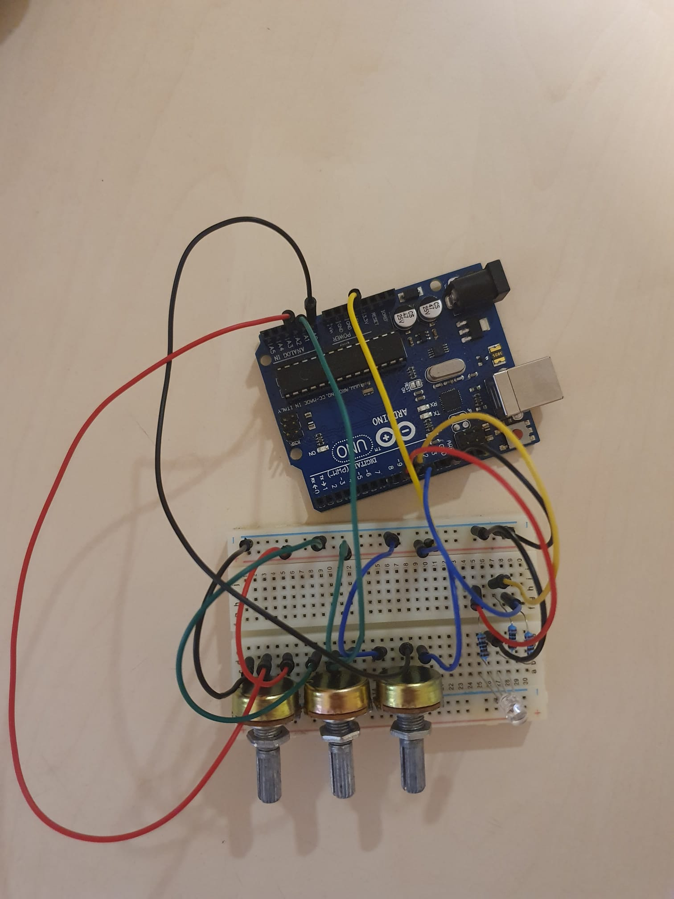
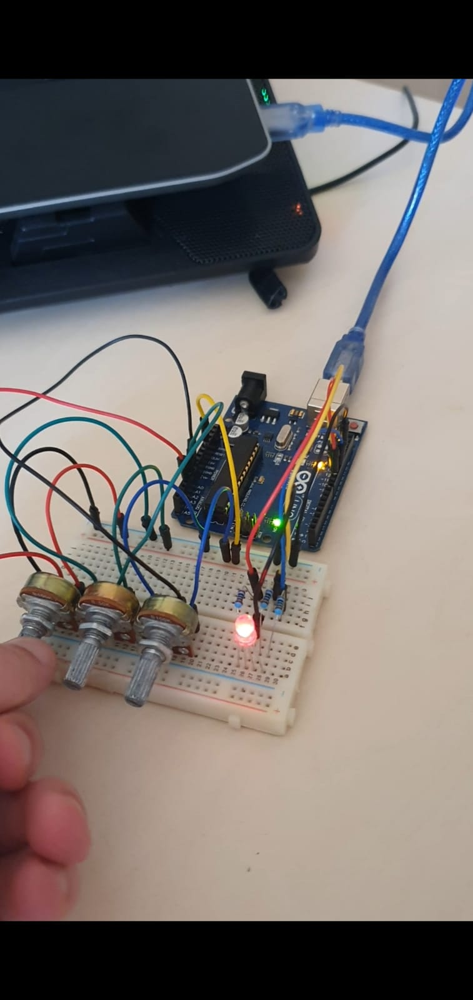
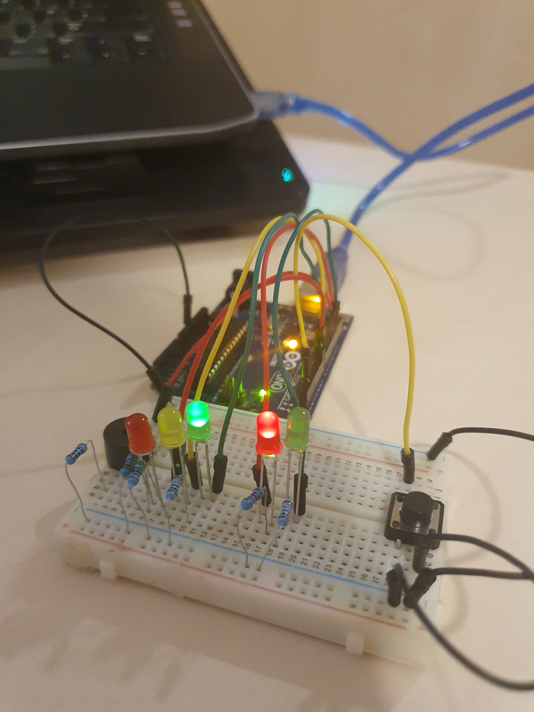
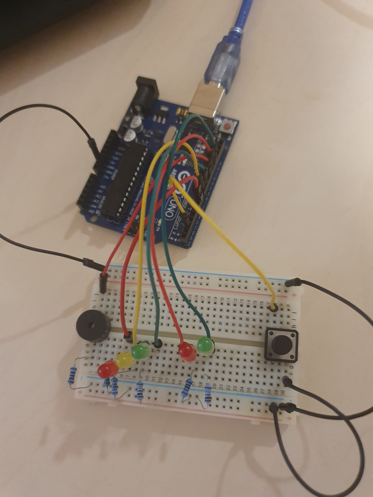
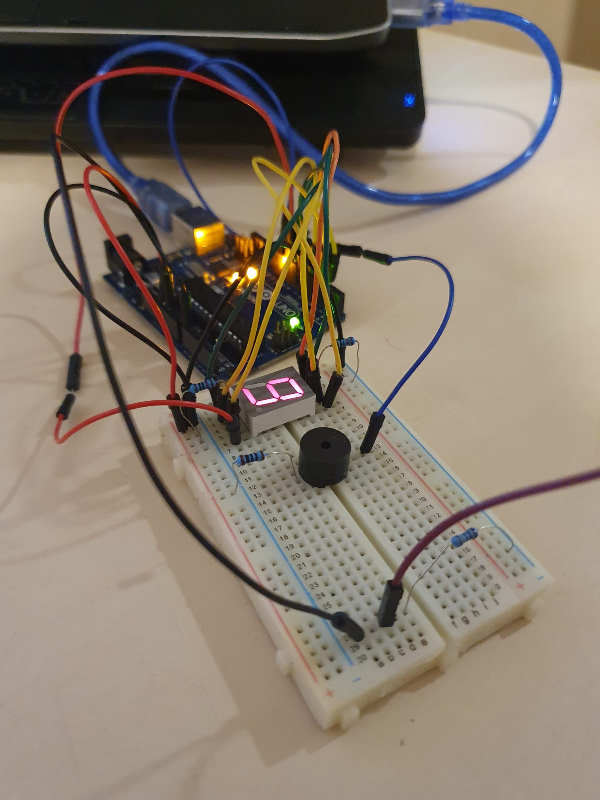
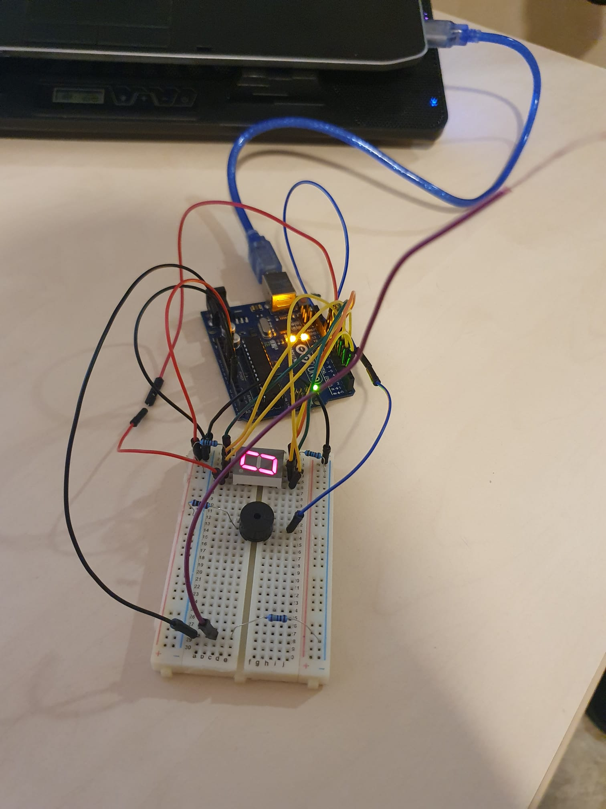

# IntroductionToRobotics (2021 - 2022)
Introduction to Robotics laboratory homeworks, taken in the 3rd year at the Faculty of Mathematics and Computer Science, University of Bucharest. Each homework includes requirements, implementation details, code and image files.

## Homework 1

 
 See details 

 
### Components

RBG led (1 minimum), potentiometers (3 minimum), resistors and wires (per logic).

### Technical Task

Use a separat potentiometer in controlling each of the color of the RGB led (Red, Green and Blue). The control must be done with digital electronics (aka you must read the value of the potentiometer with Arduino, and write a mapped value to each of the pins connected to the led.

### Setup

You can find the code [here](https://github.com/AlexandruMihai22/IntroductionToRobotics/blob/main/Homework_1/Homework_1.ino)

### Video
You can find a demo at: [youtube](https://www.youtube.com/shorts/NxNfzfaFPoc)

 

  

## Homework 2

 

 
 See details 

  
### Components

5 LEDs, 1 button, 1 buzzer, resistors and wires (per logic)

### Technical Task

Building  the  traffic  lights  for  a  crosswalk. You will use 2 LEDs to represent the traffic lights for people (red and green) and 3 LEDs to represent the traffic lights for cars (red, yellow and green).

The system has the following states:
1. State 1(default, reinstated after state 4 ends):  green light for cars,red  light  for  people,  no  sounds.   Duration:  indefinite,  changed  bypressing the button.
2. State 2(initiated by counting down 10 seconds after a button press):the  light  should  be  yellow  for  cars,  red  for  people  and  no  sounds.Duration:  3 seconds.
3. State 3(iniated after state 2 ends): red for cars, green for people anda beeping sound from the buzzer at a constant interval.  Duration:10 seconds.
4. State 4(initiated after state 3 ends):  red for cars,blinking greenfor people and a beeping sound from the buzzer, at a constant inter-val, faster than the beeping in state 3.

### Setup

You can find the code [here](https://github.com/AlexandruMihai22/IntroductionToRobotics/blob/main/Homework_2/Homework_2.ino)

### Video
You can find a demo at: [youtube](https://www.youtube.com/shorts/SMoA_wwZwWM)

 

 

## Homework 3
 
 

 
 See details 

### Components

buzzer, 7-segment display, resistors and wires (per logic)

### Technical Task

Build a ghost detector. Should detect EMF (check body and near outlets.  DO NOT IN-SERT INTO OUTLET - AKA NU-L BAGATI IN PRIZA). It should print the value on the 7-segment display and should make a sound based on the intensity.

### Setup
  

You can find the code [here](https://github.com/AlexandruMihai22/IntroductionToRobotics/blob/main/Homework_3/Homework_3.ino)

### Video
You can find a demo at: [youtube](https://www.youtube.com/shorts/MY54exrQ09U)

## Homework 4
 
 

 
 See details 

### Components

a  joystick,  a  4  digit  7-segment  display,  a  74hc595  shiftregister, resistors and wires (per logic)

### Description
 
Using  a  joystick  in  setting  the  values  on  each  digit  of  a  4-digit7-segment display connected to a shift register 74hc595. 

### Technical Task
 
First  state:   you  can  use  a  joystick  axis  to  cycle  through  the  4digits; using the other axis does nothing.  A blinking decimal point shows the current digit position. When pressing the button (must use interrupt for  maximum  points!),  you  lock  in  on  the  selected  digit  and  enter  the second state.  In this state, the decimal point stays always on, no longer blinking and you can no longer use the axis to cycle through the 4 digits. Instead, using the other axis, you can increment or decrement the number on the current digit. Pressing the button again returns you to the previous state. For bonus, save the last value in eeprom and load it when starting arduino. Also, keep in mind that when changing the number, you must increment it for each joystick movement - it should not work continuosly increment if you keep the joystick in one position.

### Setup
  

You can find the code [here](https://github.com/AlexandruMihai22/IntroductionToRobotics/blob/main/Homework_4/Homework_4.ino)

### Video
You can find a demo at: [youtube](https://www.youtube.com/watch?v=V0mh6iswJhY)

